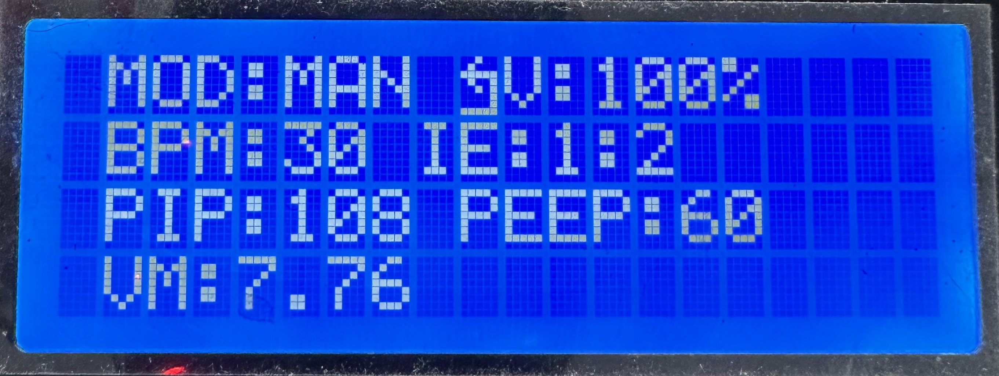
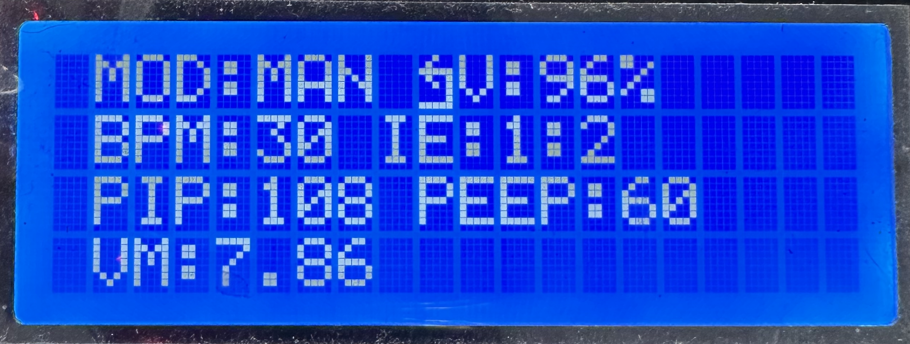
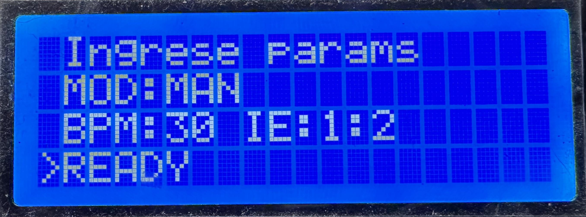
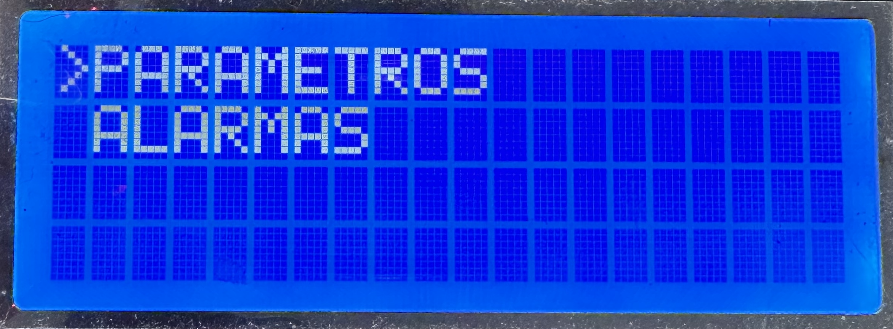
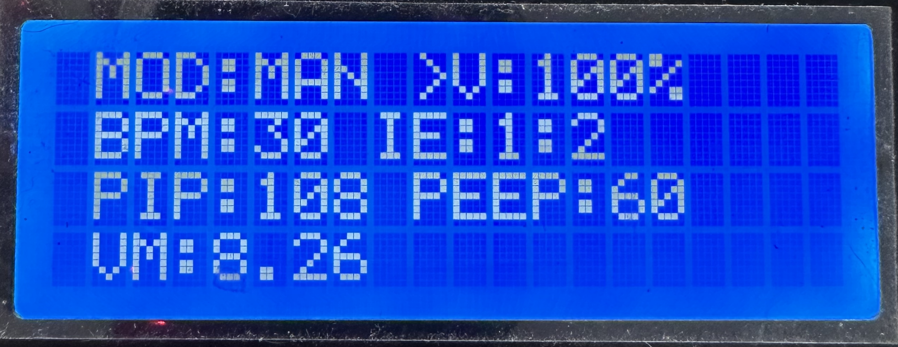
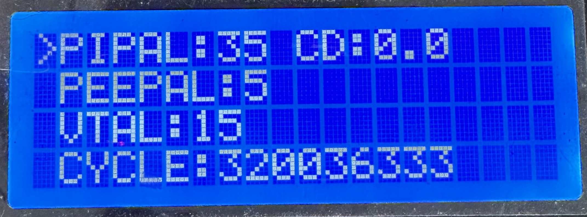

## Manual de Uso de Menu

Los objetivos de la implementación del menú son:
* Mejorar la usabilidad del sistema
* Eliminar dependencias con funcionalidades deprecadas

### Navegación

Cuando el respirador termina la etapa de inicialización, el menú que se mostrará en la pantalla será el menú principal. Si no hay actividad en el teclado del respirador tras 10 segundos la pantalla mostrará el menú parámetros ya que el mismo muestra datos de vital importancia para el operario.

Para moverse entre menús, es necesario presionar el botón de `BACK` para ir al menú principal y allí mover el cursor a la opción deseada. Si se presiona `BACK` estando en el menú principal, no se realizará ninguna acción.

Para moverse entre opciones dentro de un menú, solo es necesario mover las teclas < o  > del teclado. Para editar el valor de una determinada opción, el cursor `>` deberá estar situado en la opción deseada y se debe presionar `ENTER`. Inmediatamente el cursor cambiará de símbolo. En ese momento, se pueden presionar las teclas `<` o `>` del teclado para decrementar o incrementar el valor en pantalla. El valor no impactará en el sistema hasta que se presione `ENTER` nuevamente, lo cual guardará el valor nuevo.
Si se desea desestimar la edición del valor, se puede presionar `BACK` y el valor editado no se guardará.

### Pantallas del menú

#### Pantalla menú de inicio

Inmediatamente despues del encendido del respirador, luego de mostrar la ifnormacion de la version del software, se mostrará la pantalla de inicio para ingresar los parametros básicos.

#### Pantalla principal

Muestra las categorías de las opciones.

#### Menú parámetros

El modo (MOD) es inmutable, pero queda reservado para futuros cambios.
PIP, PEEP y VM también son una sección de solo lectura.

En esta pantalla se editan los parámetros principales que afectan el funcionamiento directo del respirador.

#### Menú Alarmas

En esta pantalla se actualizan las alarmas para los valores límite de algunos parámetros leídos por los sensores. CD es solo lectura.

