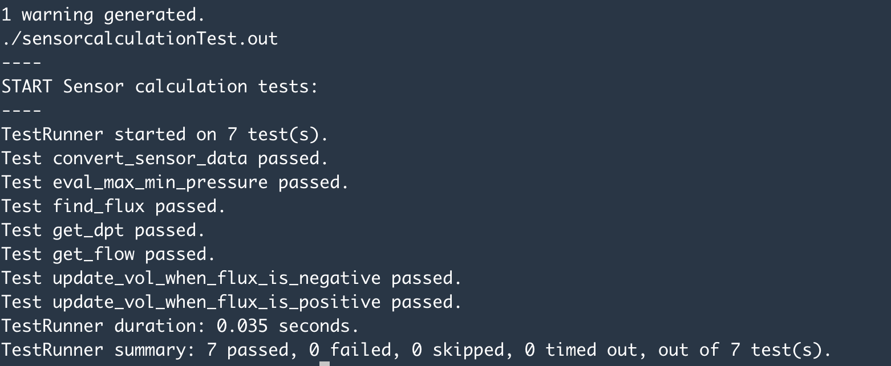

#Pruebas unitarias

Permiten garantizar que cada unidad de código funcione como se espera y que cualquier cambio posterior no cause problemas en otras partes del sistema. Para lograr esto, se escriben casos de prueba que cubran la mayor cantidad de posibles escenarios de uso y se ejecutan de forma automatizada.

###Herramientas

####Entorno de ejecución de pruebas
- EpoxyDuino: permite emular un subconjunto de instrucciones de Arduino en una computadora con sistema operativo basado en POSIX, [Ver más](https://github.com/bxparks/EpoxyDuino)

####Librerías
- AUnit: permite escribir y ejecutar pruebas unitarias para código arduino, [Ver más](https://github.com/bxparks/AUnit)
- EpoxyEeprom: permite emular la librería `EEPROM` para EpoxyDuino.

###Instalación y ejecución de pruebas unitarias

####Local
Solo podrá ejecutarse en Linux/MacOS debido a limitaciones de las herramientas:

1. Instalar `git` por línea de comandos 
2. En `src/` ejecutar `sh install-dependencies.sh` que instalará EpoxyDuino, AUnit y otras librerías y configuraciones necesarias.
3. Abrir una terminal nueva e ir a `src/ambovis/tests/unit-tests`
4. Para compilar, ejecutar `make`
5. Para ejecutar todos los tests bajo la carpeta `unit-tests/`, ejecutar el comando `make runtests`

En caso de que haya cambios en el código existente, debe limpiarse la compilacion ejecutando
`make clean` y volver a compilar con `make`

Ejecutar conjunto de pruebas de un solo componente:
1. Moverse a la carpeta del componente tal como `src/ambovis/tests/unit-tests/alarmsTest/`
2. Ejecutar `make clean` y luego `make`
3. Si la compilación fue exitosa, se generará un archivo `*.out` y puede ejecutarse como `./file.out`

####Github Actions

El proyecto esta configurado para que automáticamente al enviar un commit a cualquier rama se ejecuten las pruebas unitarias.

En la página de GitHub pueden verse las ejecuciones en la pestaña [Actions](https://github.com/luchete80/ambovis/actions) y si las pruebas fueron todas exitosas, se mostrará el ícono verde. En caso de error, se mostrará en rojo.

###Crear o modificar pruebas unitarias

Las pruebas estan escritas en C++, y el dialecto para crear pruebas simples puede ser consultado en la [documentación de AUnit](https://github.com/bxparks/AUnit#Usage).

Como guía rápida, seguir estos pasos:
1. En la carpeta `src/ambovis/tests/unit-tests` se encuentran carpetas con el nombre de cada componente seguido de `Test` para el cual se escribieron las pruebas (ejemplo: `sensorcalculationTest/`).
2. En cada carpeta se encuentra un archivo `Makefile` que posee el nombre del set de pruebas, las dependencias de compilación y la ruta a la instalación de EpoxyDuino (instalado por install-dependencies.sh)
3. En cada carpeta se encuentra un archivo `.ino` con las pruebas. Cada archivo puede contener uno o más casos de prueba, donde se instancia el componente de interés, se aplican condiciones previas, se ejecuta una acción y se verifica el resultado. 
4. Para crear pruebas sobre un nuevo componente, crear una carpeta aparte con el mismo patrón `<componente>Test`, junto con un `Makefile` y un `.ino`.

[Ver más](calidad_de_software.md)

