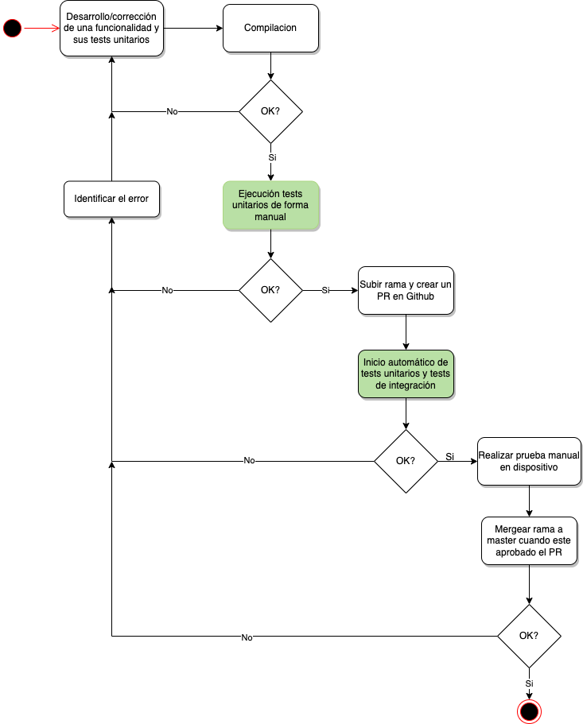

## Proceso de control de calidad del software

Un proceso de control de calidad es un conjunto de actividades que se realizan con el fin de garantizar que el software producido cumpla con los estándares y requisitos de calidad establecidos.

El proceso de control de calidad del software puede incluir varias etapas. En primer lugar, se deben establecer los requisitos de calidad para el software. Estos requisitos pueden ser internos o externos, y deben estar claramente definidos para que se puedan medir y evaluar adecuadamente.

Es importante destacar que el proceso de control de calidad del software es un proceso continuo. Es necesario realizar pruebas de calidad regularmente para asegurarse de que el software siga cumpliendo con los requisitos de calidad establecidos. Además, es importante asegurarse de que se están utilizando las mejores prácticas de desarrollo de software y herramientas de prueba de calidad para garantizar que el software producido sea de alta calidad y cumpla con los requisitos del cliente.

El control de calidad del software para sistemas embebidos presenta una serie de desafíos únicos. Estos sistemas se caracterizan por tener restricciones de recursos significativas en términos de memoria, capacidad de procesamiento y consumo de energía.

Uno de los mayores desafíos del control de calidad de software para sistemas embebidos es la necesidad de asegurar la fiabilidad y seguridad del software en situaciones críticas, donde la vida humana puede depender de su correcto funcionamiento. Esto exige un riguroso proceso de verificación y validación del software, que incluye pruebas exhaustivas para asegurar que el software cumpla con los estándares de calidad requeridos.

El costo y la complejidad de las pruebas de calidad del software para sistemas embebidos también son un desafío importante. Dado que el hardware y el software están estrechamente integrados, las pruebas deben incluir tanto pruebas de hardware como pruebas de software, lo que puede ser costoso y requiere recursos especializados.

La propuesta de este proyecto es integrar una serie de prácticas regularmente utilizadas en el desarrollo de otro tipo de sistemas para gozar de los beneficios que brindan.

### Pruebas unitarias

Permiten garantizar que cada unidad de código funcione como se espera y que cualquier cambio posterior no cause problemas en otras partes del sistema. Para lograr esto, se escriben casos de prueba que cubren todos los posibles escenarios de uso y se ejecutan de forma automatizada.

#### Flujo integrado con pruebas unitarias

